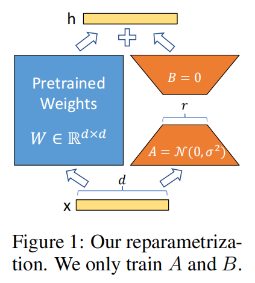
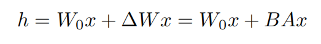

# Reading Papers

## Pioneering Work

> Reference:
> 1. Transformer: https://b23.tv/IHQ3NBE
> 2. DETR: https://b23.tv/Qy47ExG
> 3. ViT: https://b23.tv/W4UdTX6
> 4. CLIP: https://b23.tv/0rTiChh

- Transformer: https://arxiv.org/abs/1706.03762: **Attention Is All You Need**. Ashish Vaswani et al. 2017. [pdf](pdfs/Transformer_Ashish_Vaswani_et_al_1706.03762.pdf)
- DETR: https://arxiv.org/abs/2005.12872: **End-to-End Object Detection with Transformers**. Nicolas Carion et al. 2020. [pdf](pdfs/DETR_Nicolas_Carion_et_al_2005.12872.pdf)
- ViT: https://arxiv.org/abs/2010.11929: **An Image is Worth 16x16 Words: Transformers for Image Recognition at  Scale**. Alexey Dosovitskiy et al. 2020. [pdf](pdfs/ViT_Alexey_Dosovitskiy_et_al_2010.11929.pdf)
- CLIP: https://arxiv.org/abs/2103.00020: **Learning Transferable Visual Models From Natural Language Supervision**. Alec Radford et al. 2021. [pdf](pdfs/CLIP_Alec_Radford_et_al_2103.00020.pdf)

## Downstream Task

### Backbone

> Reference:
> 1. Swin-Transformer: https://b23.tv/buruBr8

- Swin-Transformer: https://arxiv.org/abs/2103.14030: **Swin Transformer: Hierarchical Vision Transformer using Shifted Windows**. Ze Liu et al. 2021. [pdf](pdfs/Swin-Transformer_Ze_Liu_et_al_2103.14030.pdf)

### Object Detection

> Reference:
> 1. detrex: https://github.com/IDEA-Research/detrex

- Deformable-DETR: https://arxiv.org/abs/2010.04159: **Deformable DETR: Deformable Transformers for End-to-End Object Detection**. Xizhou Zhu et al. 2020. [pdf](pdfs/Deformable-DETR_Xizhou_Zhu_et_al_2010.04159.pdf)
- Conditional-DETR: https://arxiv.org/abs/2108.06152: **Conditional DETR for Fast Training Convergence**. Depu Meng et al. 2021. [pdf](pdfs/Conditional-DETR_Depu_Meng_et_al_2108.06152.pdf)
- Anchor-DETR: https://arxiv.org/abs/2109.07107: **Anchor DETR: Query Design for Transformer-Based Object Detection**. Yingming Wang et al. 2021. [pdf](pdfs/Anchor-DETR_Yingming_Wang_et_al_2109.07107.pdf)
- DAB-DETR: https://arxiv.org/abs/2201.12329: **DAB-DETR: Dynamic Anchor Boxes are Better Queries for DETR**. Shilong Liu et al. 2022. [pdf](pdfs/DAB-DETR_Shilong_Liu_et_al_2201.12329.pdf)
- DN-DETR: https://arxiv.org/abs/2203.01305: **DN-DETR: Accelerate DETR Training by Introducing Query DeNoising**. Feng Li et al. 2022. [pdf](pdfs/DN-DETR_Feng_Li_et_al_2203.01305.pdf)
- DINO: https://arxiv.org/abs/2203.03605: **DINO: DETR with Improved DeNoising Anchor Boxes for End-to-End Object  Detection**. Hao Zhang et al. 2022. [pdf](pdfs/DINO_Hao_Zhang_et_al_2203.03605.pdf)
- Co-DETR: https://arxiv.org/abs/2211.12860: **DETRs with Collaborative Hybrid Assignments Training**. Zhuofan Zong et al. 2022. [pdf](pdfs/Co-DETR_Zhuofan_Zong_et_al_2211.12860.pdf)

### Image Segmentation

> Reference:
> 1. Universal Image Segmentation: https://huggingface.co/blog/mask2former

- MaskFormer: https://arxiv.org/abs/2107.06278: **Per-Pixel Classification is Not All You Need for Semantic Segmentation**. Bowen Cheng et al. 2021. [pdf](pdfs/MaskFormer_Bowen_Cheng_et_al_2107.06278.pdf)
- Mask2Former: https://arxiv.org/abs/2112.01527: **Masked-attention Mask Transformer for Universal Image Segmentation**. Bowen Cheng et al. 2021. [pdf](pdfs/Mask2Former_Bowen_Cheng_et_al_2112.01527.pdf)
- MaskDINO: https://arxiv.org/abs/2206.02777: **Mask DINO: Towards A Unified Transformer-based Framework for Object  Detection and Segmentation**. Feng Li et al. 2022. [pdf](pdfs/MaskDINO_Feng_Li_et_al_2206.02777.pdf)
- Oneformer: https://arxiv.org/abs/2211.06220: **OneFormer: One Transformer to Rule Universal Image Segmentation**. Jitesh Jain et al. 2022. [pdf](pdfs/Oneformer_Jitesh_Jain_et_al_2211.06220.pdf)

### Keypoint  Detection

- ViTDet: https://arxiv.org/abs/2203.16527: **Exploring Plain Vision Transformer Backbones for Object Detection**. Yanghao Li et al. 2022. [pdf](pdfs/ViTDet_Yanghao_Li_et_al_2203.16527.pdf)
- ViTPose: https://arxiv.org/abs/2204.12484: **ViTPose: Simple Vision Transformer Baselines for Human Pose Estimation**. Yufei Xu et al. 2022. [pdf](pdfs/ViTPose_Yufei_Xu_et_al_2204.12484.pdf)
- ViTPose++: https://arxiv.org/abs/2212.04246: **ViTPose++: Vision Transformer for Generic Body Pose Estimation**. Yufei Xu et al. 2022. [pdf](pdfs/ViTPose++_Yufei_Xu_et_al_2212.04246.pdf)

## Learning Paradigm

### Contrastive Learning

> Reference:
> 1. MoCo: https://b23.tv/khDz0mx
> 2. MoCo-v2/v3: https://b23.tv/hgy75AS

- MoCo: https://arxiv.org/abs/1911.05722: **Momentum Contrast for Unsupervised Visual Representation Learning**. Kaiming He et al. 2019. [pdf](pdfs/MoCo_Kaiming_He_et_al_1911.05722.pdf)
- MoCo-v2: https://arxiv.org/abs/2003.04297: **Improved Baselines with Momentum Contrastive Learning**. Xinlei Chen et al. 2020. [pdf](pdfs/MoCo-v2_Xinlei_Chen_et_al_2003.04297.pdf)
- MoCo-v3: https://arxiv.org/abs/2104.02057: **An Empirical Study of Training Self-Supervised Vision Transformers**. Xinlei Chen et al. 2021. [pdf](pdfs/MoCo-v3_Xinlei_Chen_et_al_2104.02057.pdf)
- DINO: https://arxiv.org/abs/2104.14294: **Emerging Properties in Self-Supervised Vision Transformers**. Mathilde Caron et al. 2021. [pdf](pdfs/DINO_Mathilde_Caron_et_al_2104.14294.pdf)
- DINOv2: https://arxiv.org/abs/2304.07193: **DINOv2: Learning Robust Visual Features without Supervision**. Maxime Oquab et al. 2023. [pdf](pdfs/DINOv2_Maxime_Oquab_et_al_2304.07193.pdf)

### Mask Image Modeling

> Reference:
> 1. MAE: https://b23.tv/RGS2Pu5

- MAE: https://arxiv.org/abs/2111.06377: **Masked Autoencoders Are Scalable Vision Learners**. Kaiming He et al. 2021. [pdf](pdfs/MAE_Kaiming_He_et_al_2111.06377.pdf)
- BEiT: https://arxiv.org/abs/2106.08254: **BEiT: BERT Pre-Training of Image Transformers**. Hangbo Bao et al. 2021. [pdf](pdfs/BEiT_Hangbo_Bao_et_al_2106.08254.pdf)
- BEiT-v2: https://arxiv.org/abs/2208.06366: **BEiT v2: Masked Image Modeling with Vector-Quantized Visual Tokenizers**. Zhiliang Peng et al. 2022. [pdf](pdfs/BEiT-v2_Zhiliang_Peng_et_al_2208.06366.pdf)
- BEiT-v3: https://arxiv.org/abs/2208.10442: **Image as a Foreign Language: BEiT Pretraining for All Vision and  Vision-Language Tasks**. Wenhui Wang et al. 2022. [pdf](pdfs/BEiT-v3_Wenhui_Wang_et_al_2208.10442.pdf)
- EVA-01: https://arxiv.org/abs/2211.07636: **EVA: Exploring the Limits of Masked Visual Representation Learning at  Scale**. Yuxin Fang et al. 2022. [pdf](pdfs/EVA-01_Yuxin_Fang_et_al_2211.07636.pdf)
- EVA-02: https://arxiv.org/abs/2303.11331: **EVA-02: A Visual Representation for Neon Genesis**. Yuxin Fang et al. 2023. [pdf](pdfs/EVA-02_Yuxin_Fang_et_al_2303.11331.pdf)

### Active Learning

- SALOD: https://arxiv.org/abs/2004.04699: **Scalable Active Learning for Object Detection**. Elmar Haussmann et al. 2020. [pdf](pdfs/SALOD_Elmar_Haussmann_et_al_2004.04699.pdf)

## Large Model

### Diffusion Model

- Stable-Diffusion: https://arxiv.org/abs/2112.10752: **High-Resolution Image Synthesis with Latent Diffusion Models**. Robin Rombach et al. 2021. [pdf](pdfs/Stable-Diffusion_Robin_Rombach_et_al_2112.10752.pdf)

### PEFT

> Reference: 
> 1. https://b23.tv/i9GVaAs
> 2. https://huggingface.co/blog/peft

- LoRA: https://arxiv.org/abs/2106.09685: **LoRA: Low-Rank Adaptation of Large Language Models**. Edward J. Hu et al. 2021. [pdf](pdfs/LoRA_Edward_J._Hu_et_al_2106.09685.pdf)
    - code: https://github.com/microsoft/LoRA
    - Low-Rank Adaptation, or LoRA, which freezes the pretrained model weights and injects trainable rank decomposition matrices into each layer of the Transformer architecture, greatly reducing the number of trainable parameters for downstream tasks.
    - compared to adapters, no additional inference latency

    

    

- ViT-Adapter: https://arxiv.org/abs/2205.08534: **Vision Transformer Adapter for Dense Predictions**. Zhe Chen et al. 2022. [pdf](pdfs/ViT-Adapter_Zhe_Chen_et_al_2205.08534.pdf)

### Multi-Modal

open-vocabulary object detection:

- ViLD: https://arxiv.org/abs/2104.13921: **Open-vocabulary Object Detection via Vision and Language Knowledge  Distillation**. Xiuye Gu et al. 2021. [pdf](pdfs/ViLD_Xiuye_Gu_et_al_2104.13921.pdf)
- GroundingDINO: https://arxiv.org/abs/2303.05499: **Grounding DINO: Marrying DINO with Grounded Pre-Training for Open-Set  Object Detection**. Shilong Liu et al. 2023. [pdf](pdfs/GroundingDINO_Shilong_Liu_et_al_2303.05499.pdf)

class-agnostic object detection:

- MViTs: https://arxiv.org/abs/2111.11430: **Class-agnostic Object Detection with Multi-modal Transformer**. Muhammad Maaz et al. 2021. [pdf](pdfs/MViTs_Muhammad_Maaz_et_al_2111.11430.pdf)

## Autonomous Driving

### BEV

- LSS: https://arxiv.org/abs/2008.05711: **Lift, Splat, Shoot: Encoding Images From Arbitrary Camera Rigs by  Implicitly Unprojecting to 3D**. Jonah Philion et al. 2020. [pdf](pdfs/LSS_Jonah_Philion_et_al_2008.05711.pdf)
- BevDet: https://arxiv.org/abs/2112.11790: **BEVDet: High-performance Multi-camera 3D Object Detection in  Bird-Eye-View**. Junjie Huang et al. 2021. [pdf](pdfs/BevDet_Junjie_Huang_et_al_2112.11790.pdf)
- BevVerse: https://arxiv.org/abs/2205.09743: **BEVerse: Unified Perception and Prediction in Birds-Eye-View for  Vision-Centric Autonomous Driving**. Yunpeng Zhang et al. 2022. [pdf](pdfs/BevVerse_Yunpeng_Zhang_et_al_2205.09743.pdf)
- BevFormer: https://arxiv.org/abs/2203.17270: **BEVFormer: Learning Bird's-Eye-View Representation from Multi-Camera  Images via Spatiotemporal Transformers**. Zhiqi Li et al. 2022. [pdf](pdfs/BevFormer_Zhiqi_Li_et_al_2203.17270.pdf)

### Occ

- NeRF: https://arxiv.org/abs/2003.08934: **NeRF: Representing Scenes as Neural Radiance Fields for View Synthesis**. Ben Mildenhall et al. 2020. [pdf](pdfs/NeRF_Ben_Mildenhall_et_al_2003.08934.pdf)
- 3DGS: {{https://repo-sam.inria.fr/fungraph/3d-gaussian-splatting/}}
- TPVFormer: https://arxiv.org/abs/2302.07817: **Tri-Perspective View for Vision-Based 3D Semantic Occupancy Prediction**. Yuanhui Huang et al. 2023. [pdf](pdfs/TPVFormer_Yuanhui_Huang_et_al_2302.07817.pdf)

### End-to-End

- UniAD: https://arxiv.org/abs/2212.10156: **Planning-oriented Autonomous Driving**. Yihan Hu et al. 2022. [pdf](pdfs/UniAD_Yihan_Hu_et_al_2212.10156.pdf)
- E2EADSurvey: https://arxiv.org/abs/2306.16927: **End-to-end Autonomous Driving: Challenges and Frontiers**. Li Chen et al. 2023. [pdf](pdfs/E2EADSurvey_Li_Chen_et_al_2306.16927.pdf)

## Vision Language Model

## World Model
